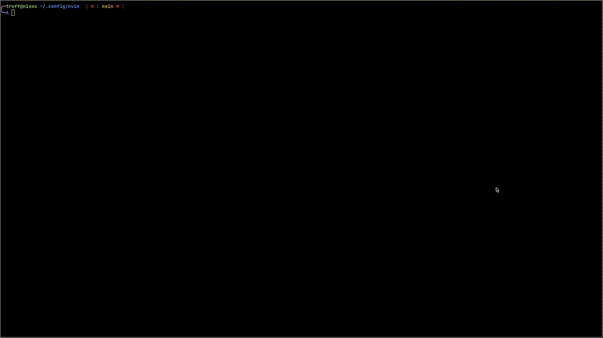

<!--toc:start-->
- [Sesh.nvim](#seshnvim)
  - [Installation](#installation)
  - [Configuration](#configuration)
  - [Telescope Integration](#telescope-integration)
    - [Enabling](#enabling)
    - [Bindings](#bindings)
  - [Exposed Functions](#exposed-functions)
    - [sesh.save()](#seshsave)
    - [sesh.delete()](#seshdelete)
    - [sesh.load()](#seshload)
    - [sesh.switch()](#seshswitch)
    - [sesh.read_sessions_info()](#seshreadsessionsinfo)
    - [sesh.opened_session()](#seshopenedsession)
    - [sesh.read_opts()](#seshreadopts)
    - [sesh.list()](#seshlist)
    - [sesh.update_sessions_info()](#seshupdatesessionsinfo)
- [Special Thanks to](#special-thanks-to)
<!--toc:end-->

# Sesh.nvim



## Installation

Telescope is optional but is recommended

[lazy.nvim](https://github.com/folke/lazy.nvim)

```lua
  {"Trouble-Truffle/sesh.nvim", dependencies = {"nvim-telescope/telescope.nvim"}}
```

[packer.nvim](https://github.com/wbthomason/packer.nvim)

```lua
  use {"Trouble-Truffle/sesh.nvim", requires = {"nvim-telescope/telescope.nvim"}}"}
```

## Configuration

```lua
  require("sesh").setup({
      autosave = {
        enable = false -- Autosave on writes and exit
        autocmds = {} -- Save on additional autocmds
      }
      autoload = false -- Load a session if `cwd` matches
      autoswitch {
        enable = false -- Close buffers in current session before loading
        exclude_ft = {} -- Disable certain buffers from being closed
      }
      sessions_info = vim.fn.stdpath('data') .. "/session-info.json"
        -- Location of the json file containing session infos
      session_path = vim.fn.stdpath('data') .. "/sesions"
        -- Location of stored session files
    })
```

## Telescope Integration


### Enabling

```lua
  require("telescope").load_extension('sesh')
```

From there you can call `Telescope sesh` or via lua `require('telescope').extensions.sesh.sesh()`

### Bindings

| mode | bind    | action                             |
| ---- | ------- | ---------------------------------- |
| `n`  | `d`     | calls `sesh.delete()` on selection |
| `i`  | `<A-x>` | calls `sesh.delete()` on selection |
| `*`  | `<CR>`  | calls `sesh.load()` on selection   |

## Exposed Functions

### sesh.save()

Saves a session from the current working directory. When not in a session it Calls `vim.ui.input` to get the name. Otherwise it launches a y/n prompt

### sesh.delete()

Deletes the provided session. If called without arguments it launches `vim.ui.select` to choose.

### sesh.load()

Loads the provided session. If called without arguments it launches `vim.ui.select` to choose. If `autoswitch` is enabled it calls upon `sesh.switch()`

### sesh.switch()

Simillar to `sesh.load` but instead it requires an argument. Switching closes all current buffers before sourcing a session.

### sesh.read_sessions_info()

Returns the contents of `session-info.json`

### sesh.opened_session()

Returns the current sourced session

### sesh.read_opts()

Returns current configuration

### sesh.list()

Returns a list of all sessions in `session_path`

### sesh.update_sessions_info()

Updates `session-info.json`

# Special Thanks to

- [leap.nvim](https://github.com/ggandor/leap.nvim) for their `make.py`
